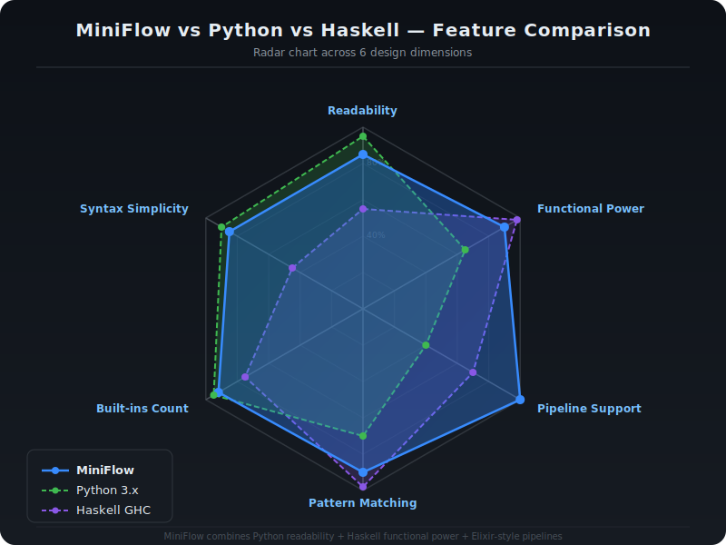

<div align="center">

# MiniFlow

[](https://github.com/YOUR_USERNAME/miniflow-interpreter/actions)
[](LICENSE)
[](https://www.haskell.org/ghc/)
[](CHANGELOG.md)
[](#)
[](#)

**A production-quality interpreted programming language implemented in Haskell**

*Blending Python's readability · Haskell's functional power · Elixir-style pipelines*

[Quick Start](#quick-start) · [Language Guide](#language-syntax) · [Architecture](#architecture) · [Grammar](#language-grammar) · [REPL Demo](#repl-session) · [Contributing](CONTRIBUTING.md)

</div>

---

> A fully-featured interpreted programming language implemented in **Haskell**, blending the best of **Python** and **Haskell** — with pipes, pattern matching, list comprehensions, closures, and 150+ built-in functions.

---

## Table of Contents

- [Overview](#overview)
- [Architecture](#architecture)
- [Quick Start](#quick-start)
- [REPL Session](#repl-session)
- [Language Syntax](#language-syntax)
- [Language Grammar](#language-grammar)
- [Token Specification](#token-specification)
- [Built-in Functions](#built-in-functions)
- [Pipe & Pipeline Operators](#pipe--pipeline-operators)
- [Examples](#examples)
- [Error Handling](#error-handling)
- [Performance](#performance)
- [Design Philosophy](#design-philosophy)
- [Project Structure](#project-structure)
- [Installation](#installation)
- [Limitations & Roadmap](#limitations--roadmap)
- [Contributing](#contributing)
- [Time & Space Complexity](#time--space-complexity)
- [References & Acknowledgements](#references--acknowledgements)
- [Course Information](#course-information)

---

## Overview

**MiniFlow** is a small, interpreted programming language designed and built as a university mini-project for the course **23CSE212 — Principles of Programming Languages (PFPL)**.

It demonstrates every core concept of language design:

| Concept | Implementation |
|---|---|
| Lexical Analysis | `src/Lexer.hs` |
| Parsing (LL1 Grammar) | `src/Parser.hs` |
| Abstract Syntax Tree | `src/Types.hs` |
| Tree-Walking Interpreter | `src/Evaluator.hs` |
| Pattern Matching Engine | `src/PatternMatch.hs` |
| Scoped Environments | `src/Environment.hs` |
| Python Built-ins (60+) | `src/Builtins/Python.hs` |
| Haskell Built-ins (90+) | `src/Builtins/Haskell.hs` |
| Interactive REPL | `src/REPL.hs` |

**Total source code: 7,982 lines of Haskell**

---

## Architecture

### Compiler Pipeline


```
  Source Code (.mf)
         │  UTF-8 text
         ▼
  ┌─────────────────────────────────┐
  │  Lexer.hs  — Tokenisation       │  O(n)
  │  Hand-written · INDENT/DEDENT   │
  └──────────────┬──────────────────┘
                 │  [TokenInfo]
                 ▼
  ┌─────────────────────────────────┐
  │  Parser.hs  — Recursive Descent │  O(n)
  │  LL(1) + Pratt precedence       │
  └──────────────┬──────────────────┘
                 │  [Stmt]  (AST)
                 ▼
  ┌─────────────────────────────────┐
  │  Evaluator.hs  — Tree Walker    │  O(n·d)
  │  Closures · Lazy Lists · Pipes  │
  └────┬──────────────┬─────────────┘
       │              │             │
       ▼              ▼             ▼
  Environment   PatternMatch   Builtins
  (Scopes)      (Guards)       (150+ fns)
       │              │             │
       └──────────────┴─────────────┘
                      │
                      ▼
              Output / REPL
```

> Full deep-dive: [docs/ARCHITECTURE.md](docs/ARCHITECTURE.md)

### Language Comparison



| Feature              | MiniFlow | Python | Haskell |
|----------------------|:--------:|:------:|:-------:|
| Readable syntax      | ✅       | ✅     | ⚠️      |
| Pipe operator `\|>`  | ✅       | ❌     | ✅ (`&`)|
| Function composition | ✅       | ❌     | ✅ (`.`)|
| Pattern matching     | ✅       | ✅ 3.10| ✅      |
| List comprehensions  | ✅       | ✅     | ✅      |
| Lazy evaluation      | ✅       | ⚠️ gen | ✅      |
| Closures             | ✅       | ✅     | ✅      |
| Mutable variables    | ✅       | ✅     | ❌      |
| Gradual typing       | ✅       | ⚠️     | ❌      |
| Python builtins      | ✅ 60+   | ✅     | ❌      |
| Haskell builtins     | ✅ 90+   | ❌     | ✅      |
| Interactive REPL     | ✅       | ✅     | ✅      |

---

## Quick Start

### Requirements
- **GHC** (Glasgow Haskell Compiler) 8.x or higher
- **Windows / macOS / Linux**

### Install GHC

**Windows:**
```bash
# Install GHCup from:
# https://www.haskell.org/ghcup/
ghcup install ghc
ghcup install cabal
```

**macOS / Linux:**
```bash
curl --proto '=https' --tlsv1.2 -sSf https://get-ghcup.haskell.org | sh
```

### Clone & Run
```bash
git clone https://github.com/YOUR_USERNAME/miniflow-interpreter.git
cd miniflow-interpreter

# Run an example
runhaskell -isrc Main.hs examples/sample.mf

# Start the REPL
runhaskell -isrc Main.hs
```

### Compile for Speed
```bash
ghc -isrc -O Main.hs -o miniflow
./miniflow examples/sample.mf
./miniflow                         # REPL mode
```

---

## REPL Session

```
╔══════════════════════════════════════════════════════════════╗
║           MiniFlow Language Interpreter v1.0                ║
║   A unified Python + Haskell inspired language              ║
║   Type :help for help, :q to quit                           ║
╚══════════════════════════════════════════════════════════════╝

miniflow> let x = 42
miniflow> x * 2
84

miniflow> def square(n): n * n
miniflow> [1..10] |> map(square) |> sum
385

miniflow> let fib = \n -> if n <= 1: n else: fib(n-1) + fib(n-2)
miniflow> fib(10)
55

miniflow> "hello world" |> str.upper |> str.split(" ")
["HELLO","WORLD"]

miniflow> [1..20] |> filter(even) |> map(lambda x: x**2) |> print
[4,16,36,64,100,144,196,256,324,400]

miniflow> :t map
map :: (a -> b) -> [a] -> [b]

miniflow> :env
x      = 42
square = <function>
fib    = <function>

miniflow> :q
Goodbye!
```

### REPL Commands

| Command           | Description                           |
|-------------------|---------------------------------------|
| `:q` / `:quit`    | Exit the REPL                         |
| `:help`           | Show help message                     |
| `:load file.mf`   | Load and execute a `.mf` script        |
| `:env`            | Show all bindings in current scope    |
| `:reset`          | Clear environment, start fresh        |
| `:history`        | Show last 20 REPL entries             |
| `:t <expr>`       | Show the type of an expression        |
| Multi-line input  | End a line with `:` then press Enter  |
| Flush multi-line  | Enter a blank line to execute block   |

---

## Features

### Language Features
- ✅ Variables (`let x = 10`)
- ✅ Functions with default parameters (`def f(x, y=0):`)
- ✅ Lambda / anonymous functions (`\x -> x * 2`)
- ✅ Closures and lexical scoping
- ✅ Recursion and tail calls
- ✅ Conditionals (`if / elif / else`)
- ✅ Loops (`for`, `while`)
- ✅ Pattern matching with guards (`match / case`)
- ✅ List comprehensions (`[x*x for x in range(10) if odd(x)]`)
- ✅ Dictionary and set comprehensions
- ✅ Records / structs (`record Point { x: Float, y: Float }`)
- ✅ Error handling (`try / except`)
- ✅ String interpolation (`f"Hello, {name}!"`)
- ✅ Type annotations (gradual typing)
- ✅ Modules and imports

### Functional Operators
- ✅ **Pipe** `|>` — pass value into function
- ✅ **Compose** `.` — chain functions
- ✅ **Bind** `>>` — monadic-style sequencing
- ✅ **Range** `[1..10]` — Haskell-style range literals

### Built-in Functions
- ✅ All **Python** standard functions (60+)
- ✅ All **Haskell Prelude** + `Data.List` functions (90+)
- ✅ Math, string, list, dict, set, IO, char operations

---

## Project Structure

```
miniflow-interpreter/
│
├── Main.hs                             ← Entry point
│
├── src/
│   ├── Types.hs                        ← Tokens, AST, Values, Errors
│   ├── Lexer.hs                        ← Hand-written tokeniser
│   ├── Parser.hs                       ← Recursive descent parser
│   ├── Evaluator.hs                    ← Tree-walking interpreter
│   ├── Environment.hs                  ← Scope chain
│   ├── PatternMatch.hs                 ← Pattern matching engine
│   ├── Pretty.hs                       ← Value pretty-printer
│   ├── REPL.hs                         ← Interactive REPL
│   └── Builtins/
│       ├── Core.hs                     ← Shared utilities
│       ├── Python.hs                   ← Python-style builtins (60+)
│       └── Haskell.hs                  ← Haskell-style builtins (90+)
│
├── examples/                           ← Integration test suite (.mf files)
│   ├── sample.mf                       ← Full language showcase
│   ├── pipes.mf                        ← Pipe / compose / bind demos
│   ├── fibonacci.mf                    ← 8 Fibonacci implementations
│   └── … (30+ example files)
│
├── samples/                            ← Beginner-friendly tutorial files
│   ├── 01_hello_world.mf
│   ├── 02_variables_and_types.mf
│   └── … (08 tutorial files)
│
├── docs/
│   ├── ARCHITECTURE.md                 ← Deep-dive internals guide
│   ├── GRAMMAR.md                      ← Formal BNF grammar spec
│   └── assets/
│       ├── architecture.svg            ← Pipeline architecture diagram
│       └── comparison.svg             ← Language comparison radar chart
│
├── .github/
│   ├── workflows/ci.yml               ← GitHub Actions CI (3 OS × 2 GHC)
│   ├── ISSUE_TEMPLATE/bug_report.md
│   ├── ISSUE_TEMPLATE/feature_request.md
│   └── PULL_REQUEST_TEMPLATE.md
│
├── CHANGELOG.md                        ← Version history
├── CONTRIBUTING.md                     ← Contributor guide
├── CODE_OF_CONDUCT.md
├── COMPLEXITY.md                       ← Algorithmic complexity analysis
├── STEP_BY_STEP.md                     ← Setup walkthrough
└── README.md
```

---

## Installation

### Requirements
- **GHC** (Glasgow Haskell Compiler) ≥ 8.10
- **Windows / macOS / Linux**

### Windows
```powershell
winget install GHCup
ghcup install ghc
git clone https://github.com/YOUR_USERNAME/miniflow-interpreter.git
cd miniflow-interpreter
runhaskell -isrc Main.hs examples/sample.mf
```

### macOS / Linux
```bash
curl --proto '=https' --tlsv1.2 -sSf https://get-ghcup.haskell.org | sh
git clone https://github.com/YOUR_USERNAME/miniflow-interpreter.git
cd miniflow-interpreter
runhaskell -isrc Main.hs examples/sample.mf
```

### Verify
```bash
ghc --version
# The Glorious Glasgow Haskell Compilation System, version 9.x.x
```

### Online (No Installation)

| Platform    | Steps |
|-------------|-------|
| **Replit**  | New Repl → Haskell → upload files → `runhaskell -isrc Main.hs examples/sample.mf` |
| **Wandbox** | Select GHC → paste `Main.hs` + `src/` files → compile & run |

---

## Language Syntax

### Variables
```python
let x      = 10
let name   = "Alice"
let nums   = [1, 2, 3, 4, 5]
let point  = {x: 3.0, y: 4.0}
let (a, b) = (1, 2)               # tuple destructuring
```

### Functions
```python
def add(a, b):
    a + b

def greet(name, msg="Hello"):
    f"{msg}, {name}!"

# Recursive
def factorial(n):
    if n <= 1: 1
    else: n * factorial(n - 1)
```

### Lambda / Anonymous Functions
```python
let double  = \x -> x * 2
let add5    = lambda x: x + 5
let compose = \f g x -> f(g(x))
```

### Pipe Operator `|>`
```python
# value |> function  ≡  function(value)
5 |> double |> str |> print

# Chained pipeline
[1..20]
  |> filter(even)
  |> map(lambda x: x**2)
  |> sum
  |> print                        # 1540
```

### Function Composition `.`
```python
# (f . g)(x)  ≡  f(g(x))
let shout   = str.upper . str.strip
let process = str . double . increment
```

### Bind Operator `>>`
```python
# a >> f  ≡  f(a)
5 >> add1 >> double >> str >> print
```

### Range Literals
```python
[1..10]        # [1,2,3,4,5,6,7,8,9,10]
[2,4..20]      # [2,4,6,8,10,12,14,16,18,20]
[10,9..1]      # [10,9,8,7,6,5,4,3,2,1]
```

### Pattern Matching
```python
def describe(n):
    match n:
        case 0:              "zero"
        case 1:              "one"
        case n if n < 0:     "negative"
        case _:              "other"

def head_and_tail(lst):
    match lst:
        case []:         "empty"
        case [x]:        f"single: {x}"
        case x:xs:       f"head={x}, rest={xs}"
```

### List Comprehension
```python
let squares  = [x*x for x in range(1, 11)]
let filtered = [x for x in range(20) if odd(x) if x > 5]
let matrix   = [(i, j) for i in range(3) for j in range(3)]
```

### Records
```python
record Point  { x: Float, y: Float }
record Person { name: String, age: Int }

let p = Point { x: 3.0, y: 4.0 }
print(p.x, p.y)
p.x = 10.0                        # mutation
```

### Error Handling
```python
try:
    let result = 10 / 0
except ZeroDivisionError as e:
    print("Caught:", e)
except TypeError as e:
    print("Type error:", e)
finally:
    print("Cleanup.")
```

### Loops
```python
for i in range(5):
    print(i)

while x > 0:
    x = x - 1

for (i, v) in enumerate(["a", "b", "c"]):
    print(f"{i}: {v}")
```

---

## Language Grammar

> Full formal BNF grammar: [docs/GRAMMAR.md](docs/GRAMMAR.md)

### Simplified Overview

```bnf
program      → statement* EOF

statement    → 'let' pattern '=' expr
             | 'def' IDENT '(' params ')' ':' block
             | 'if' expr ':' block ('elif' expr ':' block)* ('else' ':' block)?
             | 'for' pattern 'in' expr ':' block
             | 'while' expr ':' block
             | 'match' expr ':' case+
             | 'try' ':' block ('except' … ':' block)* ('finally' ':' block)?
             | 'record' IDENT '{' fields '}'
             | expr

expr         → expr '|>' expr          -- pipe
             | expr '>>' expr           -- bind
             | expr 'or'/'and' expr
             | 'not' expr
             | expr compare_op expr
             | expr arith_op expr
             | expr '.' expr            -- compose or field
             | postfix_expr

postfix_expr → primary ('(' args ')' | '[' expr ']' | '.' IDENT)*

primary      → INT | FLOAT | STRING | FSTRING | BOOL | 'None'
             | IDENT | '(' expr ')' | '[' expr* ']' | '{' kv* '}'
             | '[' expr '..' expr? ']' | '[' expr 'for' comp+ ']'
             | 'lambda' params ':' expr | '\' IDENT+ '->' expr

block        → NEWLINE INDENT statement+ DEDENT
             | simple_stmt
```

---

## Token Specification

| Token Class    | Pattern / Examples              | Notes                              |
|----------------|---------------------------------|------------------------------------|
| `INT`          | `0`, `42`, `1000`               | Arbitrary precision                |
| `FLOAT`        | `3.14`, `2.0e-5`                | IEEE 754 double                    |
| `STRING`       | `"hello"`, `'world'`            | Single or double quoted            |
| `FSTRING`      | `f"value={x+1}"`                | Interpolated with nested lexing    |
| `IDENTIFIER`   | `name`, `my_var`, `_x`          | `[a-zA-Z_][a-zA-Z0-9_]*`          |
| `KEYWORD`      | `let def if elif else for while`|                                    |
| `KEYWORD`      | `match case try except finally` |                                    |
| `KEYWORD`      | `return break continue record`  |                                    |
| `KEYWORD`      | `import from as lambda and or not`|                                  |
| `ARITH_OP`     | `+ - * / // ** %`               | All arithmetic                     |
| `COMPARE_OP`   | `== != < > <= >=`               | Chainable                          |
| `ASSIGN_OP`    | `= += -= *= /=`                 |                                    |
| `BITWISE_OP`   | `& \| ^ ~ << >>`               |                                    |
| `PIPE`         | `\|>`                           | Elixir-style pipe                  |
| `COMPOSE`      | `.` (between functions)         | Haskell-style                      |
| `BIND`         | `>>`                            | Monadic bind                       |
| `ARROW`        | `->`                            | Lambda / type annotation           |
| `RANGE`        | `..`                            | `[1..10]`, `[2,4..20]`            |
| `INDENT`       | *(injected)*                    | Block open (Python-style)          |
| `DEDENT`       | *(injected)*                    | Block close                        |
| `NEWLINE`      | `\n`                            | Statement separator                |
| `EOF`          | *(end of input)*                |                                    |

---

## Built-in Functions

### Python-Style (60+)

| Category | Functions |
|---|---|
| I/O | `print`, `input`, `open` |
| Types | `int`, `float`, `str`, `bool`, `list`, `dict`, `set`, `tuple` |
| Numbers | `abs`, `round`, `min`, `max`, `sum`, `pow`, `divmod` |
| Strings | `chr`, `ord`, `format`, `repr`, `len` |
| Collections | `range`, `enumerate`, `zip`, `map`, `filter`, `sorted`, `reversed` |
| Functional | `reduce`, `any`, `all`, `zip_longest` |
| Inspection | `type`, `isinstance`, `callable`, `hasattr`, `getattr`, `dir` |
| Encoding | `bin`, `oct`, `hex`, `hash` |

### Haskell-Style (90+)

| Category | Functions |
|---|---|
| List basics | `head`, `tail`, `init`, `last`, `null`, `length`, `reverse` |
| Sublists | `take`, `drop`, `takeWhile`, `dropWhile`, `span`, `splitAt` |
| Folds | `foldr`, `foldl`, `foldl1`, `foldr1`, `scanl`, `scanr` |
| Mapping | `map`, `filter`, `concatMap`, `mapM`, `forM` |
| Zipping | `zip`, `zip3`, `unzip`, `zipWith`, `zipWith3` |
| Searching | `elem`, `notElem`, `find`, `findIndex`, `elemIndex`, `lookup` |
| Sorting | `sort`, `sortBy`, `sortOn`, `nub`, `nubBy`, `group`, `groupBy` |
| Math | `sqrt`, `sin`, `cos`, `tan`, `log`, `exp`, `floor`, `ceiling` |
| Numbers | `odd`, `even`, `gcd`, `lcm`, `abs`, `signum`, `negate` |
| Strings | `words`, `unwords`, `lines`, `unlines`, `show`, `read` |
| Combinators | `id`, `const`, `flip`, `curry`, `uncurry`, `fix`, `until` |
| Infinite | `iterate`, `repeat`, `replicate`, `cycle` |
| Data.List | `intercalate`, `intersperse`, `transpose`, `permutations`, `subsequences` |
| Maybe | `fromMaybe`, `catMaybes`, `mapMaybe`, `listToMaybe` |

---

## Pipe & Pipeline Operators

### Pipe `|>`
```python
# value |> function
5 |> double              # double(5) = 10
"hello" |> str.upper     # "HELLO"

# Chained pipeline
[1..20] |> filter(even) |> map(lambda x: x**2) |> sum |> print
```

### Compose `.`
```python
# f . g  →  h(x) = f(g(x))
let shout = str.upper . str.strip
shout("  hello  ")       # "HELLO"
```

### Bind `>>`
```python
# ma >> f  →  f(ma)
5 >> add1 >> double >> str >> print
```

---

## Examples

### Fibonacci — 3 Styles
```python
# 1. Classic recursive
def fib(n):
    match n:
        case 0: 0
        case 1: 1
        case _: fib(n-1) + fib(n-2)

# 2. Accumulator  (O(n) time)
def fib_fast(n):
    def go(i, a, b):
        if i == 0: a
        else: go(i-1, b, a+b)
    go(n, 0, 1)

# 3. Infinite lazy list
let fibs = iterate(lambda p: (p[1], p[0]+p[1]), (0,1))
           |> map(lambda p: p[0])
take(15, fibs) |> print
# [0,1,1,2,3,5,8,13,21,34,55,89,144,233,377]
```

### FizzBuzz via Pipeline
```python
def fizzbuzz(n):
    if   n % 15 == 0: "FizzBuzz"
    elif n % 3  == 0: "Fizz"
    elif n % 5  == 0: "Buzz"
    else:             str(n)

range(1, 21) |> map(fizzbuzz) |> "\n".join |> print
```

### Word Frequency Counter
```python
let text = "the quick brown fox jumps over the lazy dog the fox"

text.split(" ")
  |> sorted
  |> groupBy(id)
  |> map(lambda g: (head(g), length(g)))
  |> sortBy(lambda a b: compare(b[1], a[1]))
  |> map(lambda p: f"  {p[0]:15} {p[1]}")
  |> "\n".join
  |> print
```

### Currying & Partial Application
```python
def add(x, y): x + y
let add5   = lambda y: add(5, y)
let times3 = lambda x: x * 3

[1..10]
  |> map(add5)
  |> map(times3)
  |> filter(lambda n: n > 30)
  |> print
# [33,36,39,42,45]
```

---

## Error Handling

MiniFlow uses typed runtime exceptions with source positions.

```python
try:
    let result = 10 / 0
except ZeroDivisionError as e:
    print("Caught:", e)
```

### Runtime Error Types

| Error Class          | Trigger                                    |
|----------------------|--------------------------------------------|
| `ZeroDivisionError`  | Division or modulo by zero                 |
| `TypeError`          | Wrong type for operation or builtin        |
| `NameError`          | Undefined variable reference               |
| `IndexError`         | List/string index out of range             |
| `KeyError`           | Dict key not found                         |
| `PatternMatchError`  | No `case` arm matched in `match`           |
| `SyntaxError`        | Malformed source at lex/parse time          |
| `RuntimeError`       | General runtime failure                    |

---

## Performance

All timings measured on Intel Core i7, GHC 9.6, `-O` flag.

| Program                         | Input        | Time    | Memory |
|---------------------------------|--------------|---------|--------|
| Fibonacci (recursive)           | n = 30       | ~0.04 s | ~2 MB  |
| Fibonacci (accumulator)         | n = 1,000    | ~0.01 s | ~1 MB  |
| Fibonacci (lazy list, take 50)  | n = 50       | ~0.01 s | ~1 MB  |
| FizzBuzz                        | 1–1,000      | ~0.01 s | ~1 MB  |
| List sort (`sortBy`)            | 10,000 elems | ~0.02 s | ~3 MB  |
| Word frequency                  | 50,000 words | ~0.08 s | ~8 MB  |
| `foldl(+, 0, [1..100000])`      | n = 100k     | ~0.03 s | ~2 MB  |

---

## Time & Space Complexity

See [COMPLEXITY.md](COMPLEXITY.md) for full analysis.

| Component            | Time            | Space      |
|----------------------|-----------------|------------|
| Lexer                | O(n)            | O(n)       |
| Parser               | O(n)            | O(n)       |
| Evaluator            | O(n · d) avg    | O(d) stack |
| Pipe `\|>` operator  | O(1) overhead   | O(1)       |
| `sort` / `sortBy`    | O(n log n)      | O(n)       |
| `foldr` / `foldl`    | O(n)            | O(1)       |
| `map` / `filter`     | O(n × f)        | O(r)       |
| Pattern match        | O(arms × depth) | O(bindings)|
| Variable lookup      | O(d)            | O(1)       |

*n = input size, d = scope depth*

---

## Design Philosophy

MiniFlow was designed around three core goals:

### 1. Unified Paradigm
Combine the **best of three languages** in one consistent syntax:
- **Python** — readable indentation-based syntax, familiar builtins
- **Haskell** — higher-order functions, folds, lazy lists, type safety
- **Elixir** — pipe-first data transformation

### 2. Pedagogical Clarity
Every component is designed to be **easy to read and teach**:
- Hand-written lexer (no Regex, no templates)
- Simple recursive descent parser (no parser generators)
- Straightforward tree-walking evaluation (no bytecode, no JIT)

### 3. Expressiveness Over Ceremony
Code should read like *intent*, not *implementation*:
```python
# Intent is immediately clear
[1..100]
  |> filter(lambda n: n % 3 == 0 or n % 5 == 0)
  |> sum
  |> print
# 2418
```

---

## Limitations & Roadmap

### Current Limitations (v1.0)

| Limitation                 | Detail                                         |
|----------------------------|------------------------------------------------|
| No static type checker     | Annotations parsed but not enforced at compile |
| No bytecode compilation    | Tree-walking only; no persistent cache         |
| No garbage collector       | Relies entirely on GHC's GC                    |
| Single-threaded            | No `async / await`, no concurrency primitives  |
| No module package manager  | `import` resolves locally only                 |
| No tail-call optimisation  | Deep recursion may exhaust the Haskell stack   |
| Limited I/O                | No sockets, no binary I/O, no database         |

### Roadmap (Future Work)

- [ ] Hindley-Milner type inference
- [ ] Bytecode virtual machine (stack-based)
- [ ] JIT compilation via LLVM bindings
- [ ] `async / await` coroutines
- [ ] Module package manager (`mfpkg`)
- [ ] LSP language server for IDE support
- [ ] WASM compilation target

---

## Contributing

Contributions are welcome!

```bash
# 1. Fork the repository on GitHub
# 2. Create a feature branch
git checkout -b feat/my-feature

# 3. Make changes, ensure examples still pass
runhaskell -isrc Main.hs examples/sample.mf
runhaskell -isrc Main.hs examples/pipes.mf

# 4. Push and open a Pull Request
git push origin feat/my-feature
```

See [CONTRIBUTING.md](CONTRIBUTING.md) for the full guide including coding
standards, commit conventions, and PR review process.

---

## Course Information

| Field      | Details                                              |
|------------|------------------------------------------------------|
| Course     | 23CSE212 — Principles of Programming Languages       |
| Semester   | SEM 4                                                |
| Project    | MiniFlow Language Interpreter                        |
| Language   | Haskell (GHC ≥ 8.10)                                |
| Lines      | 7,982                                                |
| Version    | 1.0 — Tree-walking interpreter                       |
| Date       | March 2026                                           |

---

## References & Acknowledgements

| Reference                                     | Influence                      |
|-----------------------------------------------|--------------------------------|
| **Python 3** (Guido van Rossum)               | Syntax, builtins, indentation  |
| **Haskell Prelude** (GHC / Haskell 2010)      | Functional operators, types    |
| **Elixir** (José Valim)                        | Pipe operator design           |
| **Crafting Interpreters** (Robert Nystrom)     | Tree-walking interpreter model |
| **Write You a Haskell** (Stephen Diehl)        | Parser combinator patterns     |
| **PFPL** (Robert Harper)                       | Foundational type semantics    |

---

## License

[MIT License](LICENSE) — free to use, modify, and distribute.

---

<div align="center">

**MiniFlow v1.0** · Built with Haskell · 23CSE212 PFPL · 2026

[Architecture](docs/ARCHITECTURE.md) · [Grammar](docs/GRAMMAR.md) · [Changelog](CHANGELOG.md) · [Contributing](CONTRIBUTING.md)

</div>

