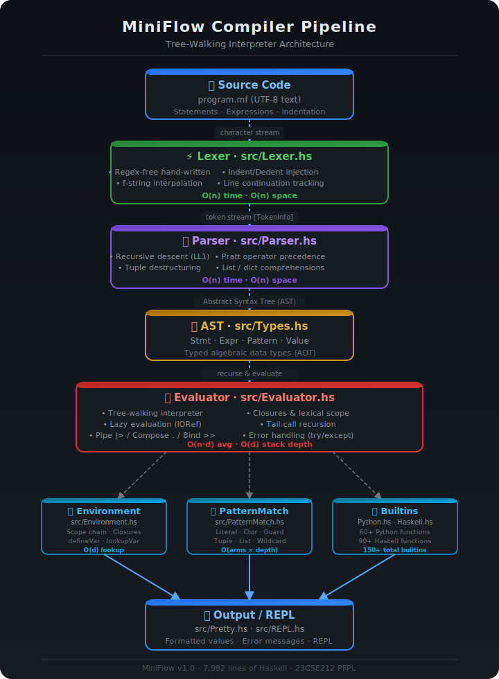

# MiniFlow Architecture — Deep Dive

> **Complete technical reference** for the MiniFlow interpreter internals.

---

## Visual Pipeline



---

## Pipeline Stages

```
┌─────────────────────────────────────────────────────────────────────────┐
│                     MiniFlow Execution Pipeline                         │
├─────────────┬──────────────────┬──────────────┬────────────────────────┤
│   STAGE     │   INPUT          │   MODULE     │   OUTPUT               │
├─────────────┼──────────────────┼──────────────┼────────────────────────┤
│ 1. Lex      │ UTF-8 source     │ Lexer.hs     │ [TokenInfo]            │
│ 2. Parse    │ [TokenInfo]      │ Parser.hs    │ [Stmt]  (AST)          │
│ 3. Evaluate │ [Stmt] + Env     │ Evaluator.hs │ Value / IO ()          │
│ 4. Print    │ Value            │ Pretty.hs    │ Formatted string       │
└─────────────┴──────────────────┴──────────────┴────────────────────────┘
```

---

## Module Breakdown

### `src/Types.hs` — The Language Spine

All shared data types live here.  Every other module imports `Types`.

```
Types.hs
 ├── SourcePos          -- file : line : col
 ├── Token              -- 80+ token variants
 ├── TokenInfo          -- Token + SourcePos
 ├── Expr               -- expression AST nodes
 ├── Stmt               -- statement AST nodes
 ├── Pattern            -- pattern match LHS variants
 ├── Value              -- runtime values (Int, Float, String, List …)
 ├── MiniFlowError      -- typed runtime exceptions
 └── LazyList           -- LNil | LCons Value (IO LazyList)
```

Key design decision: **Values are Haskell `IORef`-wrapped** where needed
(lazy lists, mutable records), giving O(1) update without garbage-collect pressure.

---

### `src/Lexer.hs` — Tokenisation

Hand-written lexer (no external libraries, no Regex).

**Algorithm**
```
Source Text
  ↓  skipWhitespace / skipComments
  ↓  lexNumber | lexIdent | lexString | lexFString | lexOperator
  ↓  insertIndentDedent   (Python-style INDENT / DEDENT)
Token Stream [TokenInfo]
```

**Indent/Dedent tracking** — `lsIndents :: [Int]` stack.
When column _increases_ → emit `TIndent`.
When column _decreases_ → emit N × `TDedent` to close open blocks.

**Parenthesis depth** — `parenDepth` counter suppresses INDENT/DEDENT
emission inside `( )`, `[ ]`, `{ }` for implicit line continuation.

**f-string parsing** — `{expr}` fragments inside `f"…"` are recursively
lexed and stored as `TFStr [FStrPart]`.

**Complexity** — O(n) time, O(n) space (output token list).

---

### `src/Parser.hs` — Recursive Descent

LL(1) recursive-descent parser with **Pratt precedence climbing** for
binary expressions.

```
parseProgram  →  [parseStatement]
parseStatement
  │ let / def / if / elif / else / for / while
  │ match / try / except / finally / return / break / continue
  │ record / import / from
  └ parseExprStatement

parseExpr (Pratt)
  ├── parsePrimary     (literals, idents, parens, lists, dicts, lambdas)
  ├── parsePostfix     (calls, index, field access, |>, ., >>)
  └── parseBinary      (precedence table 1-10)
```

**Precedence table**

| Level | Operators                     |
|-------|-------------------------------|
| 10    | `**`                          |
| 9     | `*` `/` `//` `%`             |
| 8     | `+` `-`                       |
| 7     | `<<` `>>`                     |
| 6     | `&`                           |
| 5     | `^`                           |
| 4     | `\|`                          |
| 3     | `==` `!=` `<` `>` `<=` `>=`  |
| 2     | `not`                         |
| 1     | `and` `or`                    |
| 0     | `\|>` `.` `>>`               |

**Complexity** — O(n) time, O(n) space.

---

### `src/Evaluator.hs` — Tree-Walking Interpreter

The core interpreter.  Uses mutual recursion between:

```haskell
evalStmt  :: Env -> Stmt  -> IO ()
evalExpr  :: Env -> Expr  -> IO Value
evalBlock :: Env -> [Stmt] -> IO ()
```

**Pipe operator `|>`**
```
a |> f   ≡   f(a)
```
Implemented as a postfix expression node `EPipe a f`.
Zero overhead beyond a function call.

**Compose operator `.`**
```
(f . g)(x)  ≡  f(g(x))
```
Returns a new `VFunction` closure at parse time.

**Bind operator `>>`**
```
a >> f  ≡  f(a)       -- same semantics as |>
```

**Closures** — `VFunction` captures the environment at definition time
(`envRef :: IORef Env`), implementing lexical scoping.

**Lazy lists** — `VLazyList (IORef LazyList)` uses Haskell's own IO monad
to produce elements on demand.  Supports `iterate`, `repeat`, `cycle`,
`take`, `takeWhile`, `map`, `filter`.

**Error handling** — Runtime exceptions are Haskell `Exception` instances:

```haskell
data MiniFlowError
  = MFRuntimeError  String SourcePos
  | MFTypeError     String SourcePos
  | MFNameError     String SourcePos
  | MFSyntaxError   String SourcePos
  | MFZeroDivision  SourcePos
  | MFPatternFail   SourcePos
  | MFBreak   -- control flow signal
  | MFContinue
  | MFReturn Value
```

`try/except` blocks use `Control.Exception.catch` to handle `MiniFlowError`.

---

### `src/Environment.hs` — Scope Chain

```
Global Env
 └── Function Env  (closure)
      └── Block Env  (if / for / while body)
           └── …
```

Each `Env` is `IORef (Map String Value, Maybe Env)` — a mutable map plus
optional parent link.

| Operation    | Algorithm                     | Complexity |
|--------------|-------------------------------|------------|
| `lookupVar`  | Walk chain until found        | O(d)       |
| `defineVar`  | Insert in current frame       | O(log n)   |
| `assignVar`  | Walk chain, update in place   | O(d log n) |
| `newScope`   | Allocate new IORef with parent| O(1)       |

---

### `src/PatternMatch.hs` — Pattern Engine

Handles `match / case` expressions and destructuring.

Supported pattern forms:

```
Pattern
 ├── PWild          (_)
 ├── PVar name      (binds any value)
 ├── PLit literal   (exact match)
 ├── PTuple [Pat]   ((a, b, c))
 ├── PList  [Pat]   ([x, y, z])
 ├── PCons  Pat Pat (x:xs)
 ├── PRange lo hi   (n if lo <= n <= hi)
 ├── PGuard Pat Expr (case p if guard)
 ├── PIndex Expr Expr
 └── PField Expr String
```

---

### `src/Builtins/Python.hs` & `src/Builtins/Haskell.hs`

Both modules return `Map String Value` that is merged into the global
environment at startup.

Python.hs  — mirrors CPython builtins: `print`, `range`, `zip`, `map`,
`filter`, `sorted`, `enumerate`, `reduce`, and all type coercion functions.

Haskell.hs — mirrors `Prelude` + `Data.List`: `head`, `tail`, `foldr`,
`foldl`, `scanl`, `zipWith`, `concatMap`, `nub`, `sortBy`, `groupBy`,
`intercalate`, infinite list combinators, math, Maybe helpers.

---

## Data Flow Diagram (textual)

```
  ┌──────────────────────────────────────────────────────────────────┐
  │  program.mf  (UTF-8 string)                                      │
  └──────────────────────────┬───────────────────────────────────────┘
                             │ tokenize :: String → [TokenInfo]
                             ▼
  ┌──────────────────────────────────────────────────────────────────┐
  │  [TokenInfo]  =  [(Token, SourcePos)]                            │
  │  80+ Token variants, with source position for error reporting    │
  └──────────────────────────┬───────────────────────────────────────┘
                             │ parseProgram :: [TokenInfo] → [Stmt]
                             ▼
  ┌──────────────────────────────────────────────────────────────────┐
  │  AST = [Stmt]                                                    │
  │  Stmt variants: SLet, SDef, SIf, SFor, SWhile, SMatch, STry …   │
  │  Expr variants: ELit, EVar, ECall, EBinOp, EPipe, ELambda …     │
  └──────────────────────────┬───────────────────────────────────────┘
                             │ evalProgram :: Env → [Stmt] → IO ()
                             ▼
  ┌─────────────────────────────────────────────────────────────────────────┐
  │  Evaluator (tree walk)                                                  │
  │  ├── Environment.hs  → lookupVar / defineVar / assignVar                │
  │  ├── PatternMatch.hs → matchPattern / bindPattern                       │
  │  └── Builtins/*.hs   → 150+ pre-loaded functions                        │
  └──────────────────────────┬──────────────────────────────────────────────┘
                             │ prettyValueIO :: Value → IO String
                             ▼
  ┌──────────────────────────────────────────────────────────────────┐
  │  stdout  /  REPL output                                          │
  └──────────────────────────────────────────────────────────────────┘
```

---

## Memory Model

| Construct          | Representation              | Mutability |
|--------------------|-----------------------------|------------|
| Variable binding   | `IORef (Map String Value)`  | Mutable    |
| List               | `[Value]`                   | Immutable  |
| Lazy list          | `IORef LazyList`            | Mutable    |
| Dictionary         | `Map Value Value`           | Immutable  |
| Record             | `IORef (Map String Value)`  | Mutable    |
| Closure            | `Env` + `[String]` + `Stmt` | Immutable  |

---

## Extension Points

To add a new built-in function:
1. Add the implementation to `Builtins/Python.hs` or `Builtins/Haskell.hs`
2. Register it in the `builtins` map

To add a new syntax construct:
1. Add token(s) to `Token` in `Types.hs`
2. Lex them in `Lexer.hs`
3. Add `Stmt`/`Expr` variant(s) to `Types.hs`
4. Parse them in `Parser.hs`
5. Evaluate them in `Evaluator.hs`
6. Add pretty-print case to `Pretty.hs`

---

*See [GRAMMAR.md](GRAMMAR.md) for the formal language grammar.*
